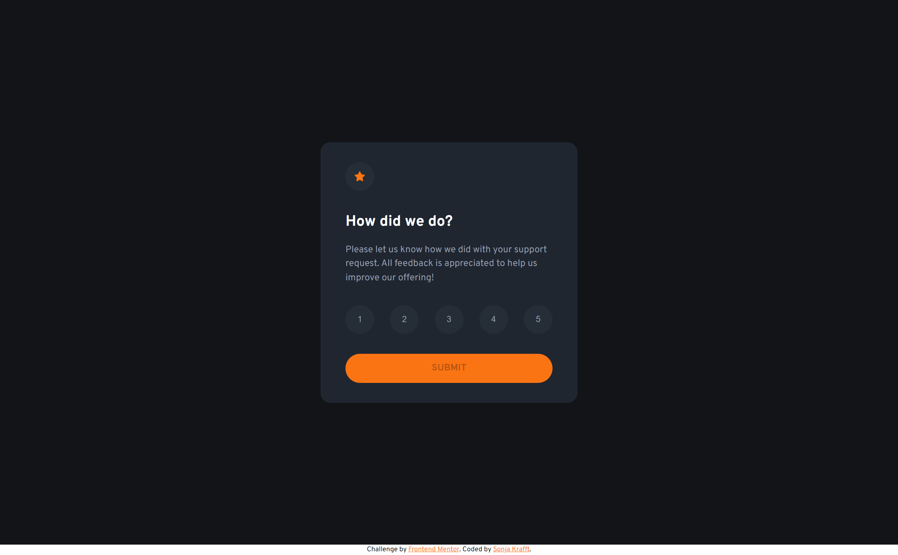
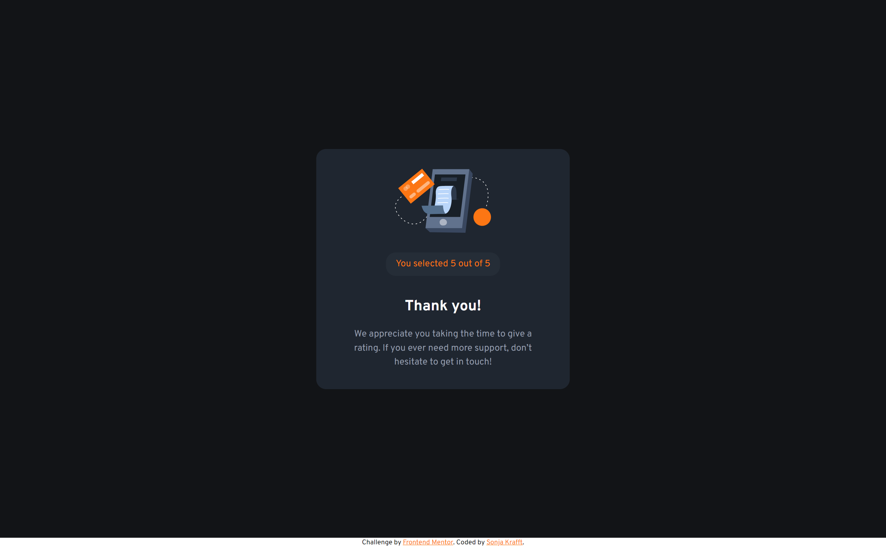
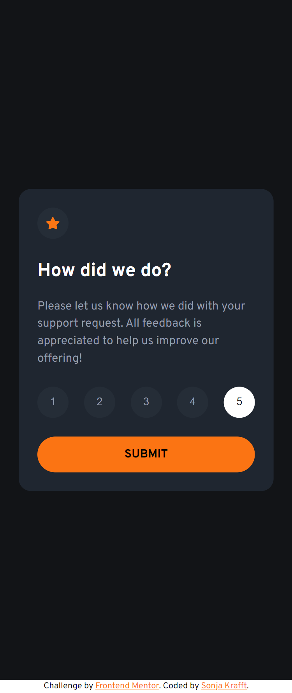

# Frontend Mentor - Interactive rating component solution

This is a solution to the [Interactive rating component challenge on Frontend Mentor](https://www.frontendmentor.io/challenges/interactive-rating-component-koxpeBUmI). Frontend Mentor challenges help you improve your coding skills by building realistic projects. 

## Table of contents

- [Overview](#overview)
  - [The challenge](#the-challenge)
  - [Screenshot](#screenshot)
- [My process](#my-process)
  - [Built with](#built-with)
  - [What I learned](#what-i-learned)
  - [Useful resources](#useful-resources)
- [Author](#author)

## Overview

### The challenge

Users should be able to:

- View the optimal layout for the app depending on their device's screen size
- See hover states for all interactive elements on the page
- Select and submit a number rating
- See the "Thank you" card state after submitting a rating

### Screenshot





## My process

### Built With

- HTML, SCSS, JS
- Mobile-first workflow
- Webstorm with Simple Hot Reload Server (install: `npm install -g simple-hot-reload-server`, start: `hrs`) and File Watcher with SCSS for building CSS

### What I learned

Use this section to recap over some of your major learnings while working through this project. Writing these out and providing code samples of areas you want to highlight is a great way to reinforce your own knowledge.

To see how you can add code snippets, see below:

- Dynamic Height of Container for any Device 
```css
.container {
  height: 100dvh;
}
```

### Useful resources

- [Accessibility Principles](https://www.w3.org/WAI/fundamentals/accessibility-principles/)
- [HTML: A good basis for accessibility](https://developer.mozilla.org/en-US/docs/Learn/Accessibility/HTML)
- [Accessible heading structure](https://www.a11yproject.com/posts/how-to-accessible-heading-structure/)
- [Farbe und Kontrast](https://web.dev/learn/accessibility/color-contrast?hl=de)
- [What’s the alternative? How to write good alt text](https://design102.blog.gov.uk/2022/01/14/whats-the-alternative-how-to-write-good-alt-text/)
- [Keyboard](https://developer.mozilla.org/en-US/docs/Web/Accessibility/Understanding_WCAG/Keyboard)
- [Keyboard Compatibility](https://www.w3.org/WAI/perspective-videos/keyboard/)
- [Captions, Transcripts, and Audio Descriptions](https://webaim.org/techniques/captions/)
- [Links](https://design.homeoffice.gov.uk/accessibility/links)
- [Accessible Icon Buttons](https://www.sarasoueidan.com/blog/accessible-icon-buttons/)
- [Forms](https://web.dev/learn/accessibility/forms?hl=de)


## Author

- Github - [Sonja Krafft](https://www.github.com/sonmikrafft)
- Frontend Mentor - [@sonmikrafft](https://www.frontendmentor.io/profile/sonmikrafft)